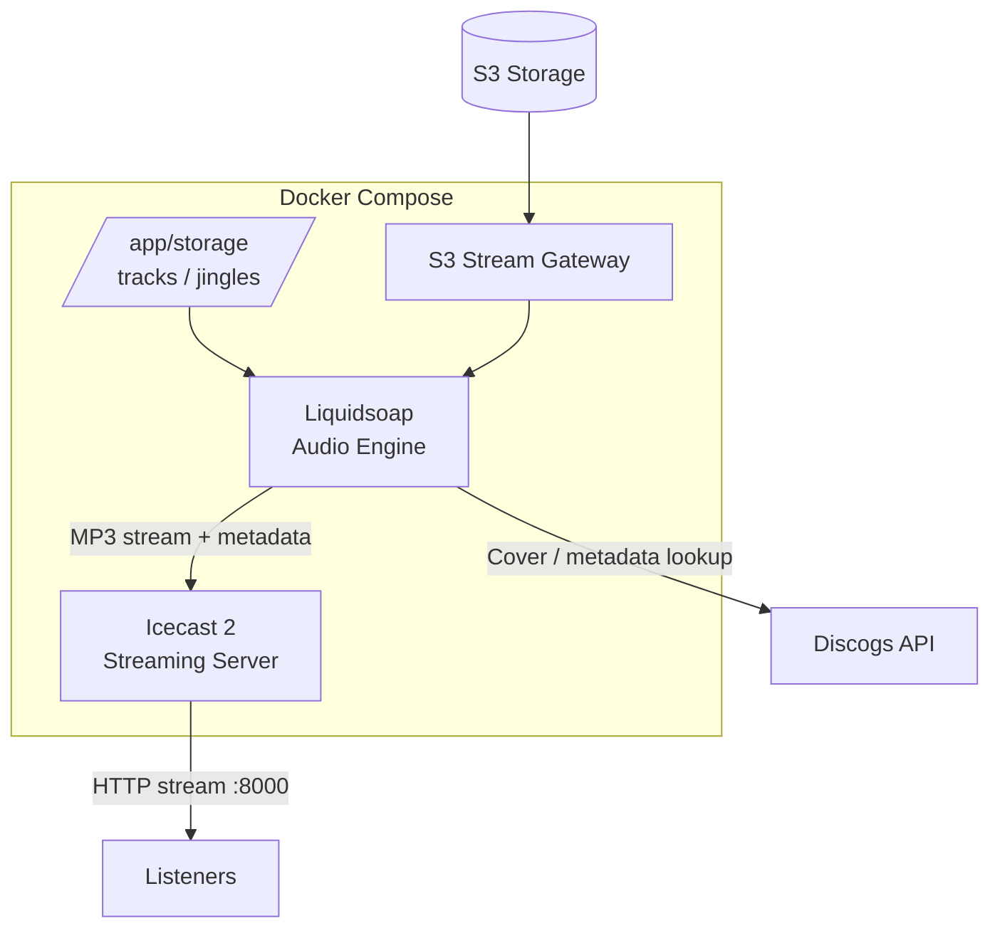

# OnAir

Docker-based internet radio stack built around **Liquidsoap** and **Icecast**.

The project provides a simple setup for running an internet radio station with local audio files or S3-based streaming.

## Architecture



## Versioning Policy

OnAir follows the upstream versioning of the software it integrates and distributes, including Icecast, Liquidsoap, and Next.js.

We do not maintain independent versions of these upstream projects. Instead, we adapt and maintain the OnAir integration code to remain compatible with the upstream versions we support.

When an upstream project releases a new version, we evaluate the changes, update the relevant OnAir code, and publish updated Docker images when compatibility has been verified.

Docker image version tags identify the corresponding upstream software version, while OnAir-specific changes are maintained in this repository.

Upstream releases do not automatically imply an immediate OnAir release. Each update may require code changes, compatibility adjustments, and testing before publication.

## Components

### Liquidsoap

Liquidsoap is the main audio engine.

It is responsible for:

- playing tracks;
- playing jingles;
- rotating tracks and jingles;
- processing audio;
- streaming audio to Icecast;
- sending ICY metadata;
- retrieving cover art from Discogs;
- optionally reading audio through the S3 streaming gateway.

Directory:

```text
liquidsoap/
├── Dockerfile
├── VERSION
├── main.liq
├── docker-entrypoint.sh
└── s3sg/
```

### Icecast

Icecast is the streaming server.

Liquidsoap connects to Icecast and publishes the radio stream. Listeners connect to Icecast to receive the stream.

```text
Liquidsoap
    │
    │ MP3 + metadata
    ▼
Icecast :8000
    │
    ▼
Listeners
```

## Audio Sources

The radio supports two audio sources.

### Local Storage

Audio files are mounted into:

```text
/app/storage/tracks
/app/storage/jingles
```

Example:

```text
storage/
├── tracks/
│   ├── song-01.mp3
│   ├── song-02.mp3
│   └── song-03.mp3
└── jingles/
    ├── jingle-01.mp3
    └── jingle-02.mp3
```

Liquidsoap randomly selects tracks and periodically inserts a jingle.

The number of tracks between jingles is controlled by:

```text
JINGLE_EVERY
```

### S3 Streaming

When `S3_BUCKET` is configured, Liquidsoap uses the S3 streaming gateway instead of the local playlists.

```text
S3
 │
 ▼
S3 Stream Gateway
 │
 ├── tracks
 │
 └── jingles
 │
 ▼
Liquidsoap
 │
 ▼
Icecast
```

## Metadata

Liquidsoap generates stream metadata from the currently playing track.

For normal tracks:

```text
Artist - Title
```

For jingles:

```text
Jingle
```

When Discogs credentials are configured, Liquidsoap can query Discogs for cover art.

```text
Track
  │
  ▼
Liquidsoap
  │
  ▼
Discogs API
  │
  ▼
Cover URL
  │
  ▼
Icecast metadata
```

## Environment

Example Liquidsoap configuration:

```yaml
environment:
  ICECAST_HOST: icecast
  ICECAST_PORT: "8000"
  ICECAST_USER: source
  ICECAST_PASSWORD: "pwd"
  ICECAST_MOUNT: /radio.mp3

  ICECAST_NAME: Radio Dream
  ICECAST_GENRE: Rock
  ICECAST_DESCRIPTION: Radio Dream
  ICECAST_URL: http://localhost:8000/radio.mp3

  JINGLE_EVERY: "4"
  STREAM_BITRATE: "128"
```

S3 can be enabled with:

```yaml
environment:
  S3_BUCKET: radio
  S3_TRACKS_PREFIX: tracks
  S3_JINGLES_PREFIX: jingles
  S3_ACCESS_KEY_ID: ...
  S3_SECRET_ACCESS_KEY: ...
```

If `S3_BUCKET` is empty, Liquidsoap uses local storage.

## Docker Compose

Build and start the complete stack:

```bash
docker compose up -d --build
```

Check containers:

```bash
docker compose ps
```

View Liquidsoap logs:

```bash
docker compose logs -f liquidsoap
```

View Icecast logs:

```bash
docker compose logs -f icecast
```

Stop the stack:

```bash
docker compose down
```

## Stream

Icecast is exposed on:

```text
http://localhost:8000
```

The stream mount is configured with:

```text
ICECAST_MOUNT
```

Example:

```text
http://localhost:8000/radio.mp3
```

## Docker Images

The project builds:

```text
ghcr.io/acayseth/icecast2
ghcr.io/acayseth/liquidsoap
```

Images are built for:

```text
linux/amd64
linux/arm64
```

Versioned images use the version from the corresponding `VERSION` file.

Example:

```text
ghcr.io/acayseth/icecast2:2.5.0
ghcr.io/acayseth/liquidsoap:2.4.5
```

Commit-specific images are also published using the Git SHA.

## Project Structure

```text
.
├── .github/
│   └── workflows/
│       ├── icecast.yml
│       └── liquidsoap.yml
│
├── icecast/
│   ├── Dockerfile
│   ├── VERSION
│   ├── docker-entrypoint.sh
│   └── icecast.xml
│
├── liquidsoap/
│   ├── Dockerfile
│   ├── VERSION
│   ├── main.liq
│   ├── docker-entrypoint.sh
│   └── s3sg/
│
├── storage/
│   ├── tracks/
│   └── jingles/
│
└── docker-compose.yml
```

## Overall Flow

```text
                    ┌─────────────────┐
                    │  Local Storage  │
                    │ tracks / jingles│
                    └────────┬────────┘
                             │
                             ▼
                    ┌─────────────────┐
                    │   Liquidsoap    │
                    │                 │
                    │ • playlist      │
                    │ • jingles       │
                    │ • normalization │
                    │ • metadata      │
                    │ • Discogs       │
                    └────────┬────────┘
                             │
                             │ MP3 + ICY metadata
                             ▼
                    ┌─────────────────┐
                    │     Icecast     │
                    │      :8000      │
                    └────────┬────────┘
                             │
                             │ HTTP stream
                             ▼
                         Listeners


                    Optional S3 path

                    ┌───────────────┐
                    │   S3 Storage  │
                    └───────┬───────┘
                            │
                            ▼
                    ┌───────────────┐
                    │ S3 Gateway    │
                    └───────┬───────┘
                            │
                            ▼
                       Liquidsoap
```

## CI/CD

GitHub Actions builds the Docker images when the corresponding project directory changes.

```text
Git push
   │
   ▼
Verify VERSION
   │
   ▼
Docker Buildx
   │
   ├── linux/amd64
   └── linux/arm64
   │
   ▼
GitHub Container Registry
   │
   ├── :VERSION
   ├── :sha-COMMIT
   └── :latest
```

The version is read from:

```text
icecast/VERSION
liquidsoap/VERSION
```

The `VERSION` file must contain:

```text
MAJOR.MINOR.PATCH
```

Example:

```text
2.5.4
```
